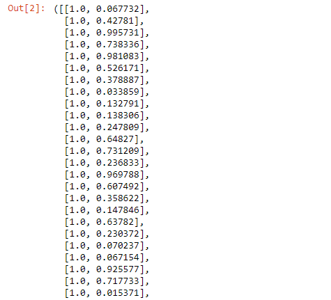
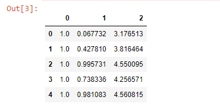
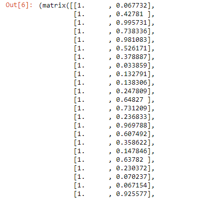
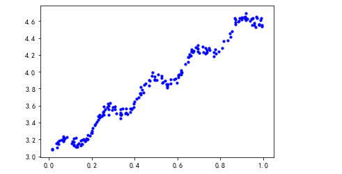
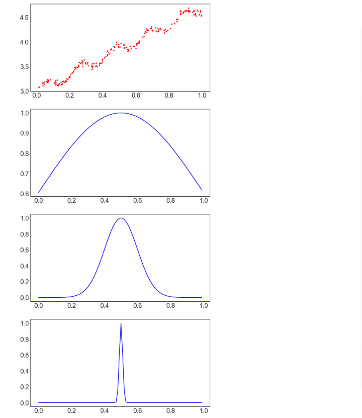
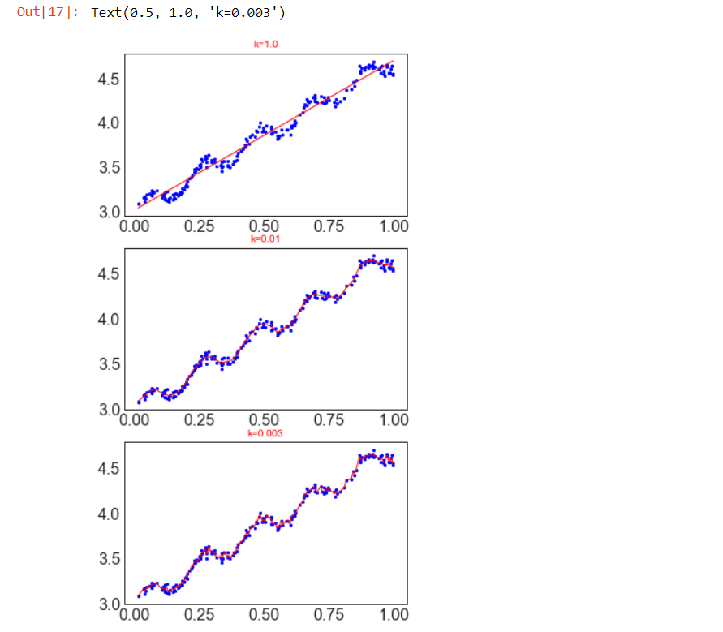

## 本章内容介绍


本章将介绍线性回归，进行python3.6的实现。在这之后引入了局部平滑技术，分析如何更加的拟合数据。接下来本章将探讨回归在“欠拟合”的情况下的缩减(shrinkage)技术，探讨偏差和方差的概念。最后，我们将融合所有技术，预测鲍鱼的年龄介绍和玩具的售价。此外为了获取一些玩具的数据，我们还将使用python来做一些采集的工作。这一章的内容会十分丰富。


##  用线性回归找到最佳拟合曲线

回归的目的预测数值型的目标值，最直接的方法是依据输入写一个目标值的计算公式。假如你想要预测姐姐男友汽车的功率大小，可能会这样算：


$$HorsePower=0.0015*annualSalary-0.99*horseListeningToPublicRadio$$

这就是所谓的回归方程(regression equation)，其中的0.0015和-0.99称为回归系数(regression weights)，求这些回归系数的过程就是回归。一旦有了这些回归系数，再给定输入，做预测就非常容易了。具体的做法是用回归系数乘以输入值，在将结果全部加在一起，就得到了预测值。


应当怎样从一大堆的数据求出回归方程呢？假定输入数据存放在矩阵**X**中，而回归系数存放在向量w中。那么对于给定的数据$x_1$，预测结果将会通过$Y_1=X^T_1w$给出。现在的问题是，手里有一些x和对应的y，怎样才能找到w呢？一个常用的方法就是找出误差最小的w。这里的误差是指预测y值和真实y值之间的差值，使用该误差的简单累加将使得正差值和负差值相互抵消，所以我们采用评查误差。

平方误差可以写做：

$$\sum_{i=1}^m(y_i-x^T_iw)^2  \rightarrow (8.1)$$  

用矩阵表示还可以写做$(y-Xw)^T(y-Xw)$。如果对w求导，得到$X^T(y-Xw)$，令其等于零，解出w如下：

$$\frac{\partial (y-Xw)(y-Xw)^T}{\partial w}$$

$$= \frac{\partial(y-Xw) (y^T- X^Tw^T)}{\partial w}$$

$$\frac{\partial y^Ty -y^TXw-w^TX^Ty+w^TX^TXw}{\partial w}$$

$$=-2X^T(y-Xw)$$

令其等于0

$$\frac{\partial (y-Xw)(y-Xw)^T}{\partial w}=0$$

$$-2X^T(y-Xw) =0$$

$$X^T(y-Xw)=0$$

$$X^Ty -X^TXw=0$$

当$$|X^TX| \neq 0$$:

$$w=(X^TX)^{-1}X^Ty  \rightarrow (8.2)$$


w上方的小标记表示，这是当前可以估计的w的最优解。从现有数据上估计的w可能并不是数据中的真实的w值，所以使用了一个“帽”符号来表示它仅使w的一个最佳估计

接下来介绍如何给出该数据的最佳拟合直线


### 导入所需要的包

```
# 导入numpy
import numpy as np
# 导入pandas
import pandas as pd
# 导入matplotlib.pyplot
import matplotlib.pyplot as plt
# 导入matplotlib
import matplotlib as mpl
# 导入random
import random
```

### 函数导入数据


```
def loadDateSet(fileName):
    '''
    函数功能：
        将每行的前len-1列和最后一列的数据转换为矩阵
    参数：
        fileName__文件名
    返回值：
        特征矩阵，标签矩阵
    '''
    # 获取特征个数
    numFeat = len(open(fileName).readline().split('\t')) -1 
    # 创建空列表dataMat
    dataMat = []   
    # 创建空列表labelMat
    labelMat = []
    # 打开文件，得到文件句柄并赋值给一个变量
    fr = open(fileName)
    # 遍历每一行数据
    for line in fr.readlines():
        # 创建空列表lineArr
        lineArr = []
        # strip() 方法用于移除字符串头尾指定的字符（空格）
        # split() 通过指定分隔符对字符串进行切片（换行符）
        curLine = line.strip().split('\t')
        # 对每一行数据进行数据处理
        for i in range(numFeat):
            # 将n-1个特征组成一个list
            lineArr.append(float(curLine[i]))
        # 双list形成矩阵
        dataMat.append(lineArr)
        # 将最后一个数值作为目标值
        labelMat.append(float(curLine[-1]))
    # 返回特征矩阵，标签矩阵
    return dataMat, labelMat

# 测试函数
loadDateSet("ex0.txt")
```
部分数据显示



### pandas导入数据

```
# 导入数据
ex0 = pd.read_table('ex0.txt', header = None)
# 显示前五行数据
ex0.head() 
```



```
# 查看数据信息（无缺失值）
ex0.info()
```


```
# 查看数据统计信息
ex0.describe()
```


```
# 使用pandas获取特征矩阵，标签矩阵
def get_Mat(dataSet):
    '''
    函数功能：
        获取特征矩阵和标签矩阵
    参数：
        dataSet__数据集
    返回值：
        特征矩阵，标签矩阵
    '''
    # iloc__位置索引，不包括-1
    # np.mat__生成矩阵xMat
    # Dataframe.values__获取Dataframe元素
    xMat = np.mat(dataSet.iloc[:, :-1].values)
    # iloc__位置索引，-1
    # np.mat__生成矩阵yMat
    # Dataframe.values__获取Dataframe元素
    yMat = np.mat(dataSet.iloc[:,-1].values).T
    # 返回矩阵xMat, yMat
    return xMat, yMat

# 函数测试
get_Mat(ex0)
```
部分数据显示




```
def plotDataSet(dataSet):
    '''
    函数功能：
        数据可视化
    参数：
        dataSet__数据集
    return:
        可视化结果(散点图)
    '''
    # dataSet通过get_Mat函数得到矩阵xMat, yMat
    xMat, yMat = get_Mat(dataSet)
    # plt.scatter__散点图
    plt.scatter(xMat.A[:,-1], yMat.A, c='b', s=10)
    # 显示图像
    plt.show()

# 函数测试
plotDataSet(ex0)
```



### 计算回归系数


$$\hat{w}=(X^TX)^{-1}X^TY  \rightarrow (8.3)$$

上述公式中包含$(X^TX)^{-1}$，也就是需要对矩阵求逆，因此这个方程只在逆矩阵的时候适用。然而，矩阵的逆可能并不存在，因此必须要在代码中对此作出判断


```
def standRegres(dataSet):
    '''
    函数功能：
        计算回归系数ws
    参数：
        dataSet__数据集
    返回值：
        ws__回归系数
     '''
    # 根据get_Mat函数返回xMat, yMat
    xMat, yMat = get_Mat(dataSet)
    # 根据公式(1.3)计算可逆部分
    xTx = xMat.T * xMat
    # 调用linalg.de()来计算行列式，行列式不能为0
    if np.linalg.det(xTx) == 0:
        # 若行列式等于0，则打印"This matrix is singular, cannot do inverse"
        print("This matrix is singular, cannot do inverse")
    # 根据公式(1.3)计算回归系数
    ws = xTx.I * (xMat.T * yMat)
    # 返回回归系数ws
    return ws

#函数测试
standRegres(ex0)
```


```
def plotReg(dataSet):
    '''
    函数功能：
        描绘数据集图像以及预测图像
    参数:
        dataSet__数据集
    返回值
    '''
    # 根据get_Mat函数返回xMat, yMat
    xMat, yMat = get_Mat(dataSet)
    # 创建画布
    fig = plt.figure(figsize=(8,6))
    # 111，表示为将图像分为1行1列，此子图占据从左到右从上到下的1位置
    # 234，表示为将图像分为2行3列，取从左到右，从上到下第4个位置
    ax = fig.add_subplot(111)
    # 使用scatter描绘数据图像（散点图）
    ax.scatter(xMat.A[:,-1], yMat.A, c='b', s=7)
    # 拷贝数据（浅拷贝）
    xCopy = xMat.copy()
    # 如果直线上的数据点次序混乱，绘图时将会出现问题，所以首先要将点按照升序排列
    xCopy.sort(0)
    # 根据standRegres函数返回回归系数
    ws = standRegres(dataSet)
    # 根据回归系数以及特征矩阵得到预测值
    yHat = xCopy * ws
    # 描绘预测函数图像
    ax.plot(xCopy[:,1], yHat, c="g")
    # 显示图像
    plt.show()
    
# 函数测试
plotReg(ex0)
```


### 计算相关系数

相关系数：通过命令corrcoef(yEstimate, yActual)来计算预测值与真实值之间的相关性


```
# 根据get_Mat函数返回xMat, yMat
xMat,yMat = get_Mat(ex0)
# 计算回归系数ws
ws = standRegres(ex0)
# 计算预测值yHat
yHat = xMat * ws
# 计算相关系数(需要将yMat转置，以保证两个向量都是为行向量)
np.corrcoef(yHat.T, yMat.T)
# yMat和自己的匹配最完美，对角线上的数据为1.0。而yHat和yMat的相关系数为0.98
```


```
# 导入R^2评估指标
from sklearn.metrics import r2_score
r2_score(yHat,yMat)
```


最佳拟合直线的方法将数据视为直线进行建模，R^2有0.97，相关系数为0.98。看起来是一个不错的表现，但是我们发现数据呈现有规律的波动，我们拟合出来的直线没有很好的拟合这些波动的数据。


## 局部线性加权


线性回归的一个问题就是可能出现欠拟合的现象，因为它求的是具有最小均方误差的无偏估计，显然易见，如果模型欠拟合将不能取得最好的预测结果。所以有些方法允许在估计中引入一些偏差，从而降低预测的均方误差。

其中的一个方法是局部加权线性回归，在该算法中，我们给待测点附近的每个点赋予一定的权重，在这个子集上基于最小均方误差来进行普通的回归。与KNN一样，这种算法每次预测均需要事先选取出对应的数据子集。该算法的回归系数w的形式为：


$$\hat{w}=(X^TWX)^{-1}X^TWy \rightarrow (8.4)$$


其中w是一个矩阵，用来給每个数据点赋予权重

lwlr使用“核”来对附近的点赋予最高的权重，最常用的就是高斯核

$$w(i,i)=exp(\frac{|x^i-x|^2}{-2k^2}) \rightarrow (8.5) $$

这样就构建了一个只含对角元素的权重矩阵w，并且点x与x(i)越近，w(i,i)将会越大。上述公式包含一个需要用户指定的参数k，它决定了对附近的点赋予多大的权重


```
# 根据函数get_Mat返回特征矩阵和标签矩阵
xMat, yMat = get_Mat(ex0)
# 假定我们正要预测的点是x=0.5
x = 0.5
# 横坐标上所有点
xi = np.arange(0, 1.0, 0.01)
# k的取值
k1, k2, k3 = 0.5, 0.1, 0.01
# 高斯核w1
w1 = np.exp((xi - x)**2 / (-2 * k1 **2))
# 高斯核w2
w2 = np.exp((xi - x)**2 / (-2 * k2 **2))
# 高斯核w3
w3 = np.exp((xi - x)**2 / (-2 * k3 **2))
# 创建画布，设定画布大小(8,4)
fig = plt.figure(figsize=(8,4))
# plt.scatter__散点图
plt.scatter(xMat.A[:,1], yMat.A ,c='r', s=5)
# 创建列表w
w = [w1, w2, w3]
# 遍历w中的元素(w1, w2, w3)
for i in w:
    # 创建画布，设定画布大小(8,4) 
    plt.figure(figsize=(8,4))
    plt.plot(xi,i,c='b')
    # 显示图像
    plt.show()
```




### 局部加权线性回归函数


$$w(i,i)=exp(\frac{|x^i-x|^2}{-2k^2}) \rightarrow (8,6)$$

$$\hat{w}=(X^TWX)^{-1}X^TWy \rightarrow (8.7)$$


```
def lwlr(testPoint, xMat, yMat, k=1.0):
    '''
    函数功能：
        给定x空间中的任意一点，计算出对应的预测值yHat
    参数：
    
    返回值：
        预测值
    '''
    # 获取testPoint索引长度
    n = testPoint.shape[0]
    # 获取xMat索引长度
    m = xMat.shape[0]
    # 构建对角矩阵w(对角线全为1，其他全为0)，阶数等于样本点个数
    weights = np.mat(np.eye(m))
    # 初始化yHat
    yHat = np.zeros(n)
    # 遍历索引n
    for i in range(n):
        # 遍历训练训练数据集(xMat)，每一个样本点对应的权重
        for j in range(m):
            # 高斯核公式
            diffMat = testPoint[i] -xMat[j]
            weights[j,j] = np.exp(diffMat * diffMat.T / (-2 * k**2))
        xTx = xMat.T * (weights * xMat)
        # 判断行列式是否为0
        if np.linalg.det(xTx) == 0:
            # 若行列式为0，打印 "This matrix is singular, cannot not inverse"
            print("This matrix is singular, cannot not inverse")
            # 程序运行到所遇到的第一个return即返回（退出def块）
            return
        # 计算回归系数
        ws = xTx.I * (xMat.T * (weights * yMat))
        # 计算testPoint对应的y值
        yHat[i] = testPoint[i] * ws
    # 返回回归系数与预测值
    return ws , yHat
```


```
# 根据get_Mat函数得到xMat,yMat
xMat, yMat = get_Mat(ex0)
# 对数据进行排序(默认为升序)，并且返回索引
srtInd = xMat[:,1].argsort(0)
# 使用索引取出数据
# xMat[srtInd]
# 返回排序后的xMat，用xSort保存变量
xSort = xMat[srtInd][:,0]
```


```
# k=1.0，返回回归系数以及预测值
ws_1, yHat_1 = lwlr(xMat, xMat, yMat, k=1.0)
# k=0.01，返回回归系数以及预测值
ws_2, yHat_2 = lwlr(xMat, xMat, yMat, k=0.01)
# k=0.003，返回回归系数以及预测值
ws_3, yHat_3 = lwlr(xMat, xMat, yMat, k=0.003)
```


```
fig = plt.figure(figsize = (5, 10))
ax1 = fig.add_subplot(311)
ax1.scatter(xMat[:,-1].A, yMat.A, c='b',s=5)
ax1.plot(xSort[:,1], yHat_1[srtInd], linewidth =1 ,color = 'r')
plt.title('k=1.0', size = 10, color = 'r')

ax2 = fig.add_subplot(312)
ax2.scatter(xMat[:,-1].A, yMat.A, c='b',s=5)
ax2.plot(xSort[:,1], yHat_2[srtInd], linewidth =1 ,color = 'r')
plt.title('k=0.01', size = 10, color = 'r')

ax3 = fig.add_subplot(313)
ax3.scatter(xMat[:,-1].A, yMat.A, c='b',s=5)
ax3.plot(xSort[:,1], yHat_3[srtInd], linewidth =1 ,color = 'r')
plt.title('k=0.003', size = 10, color = 'r')
```



上述图给出了k在三种不同取值的取值情况下的结果图，当k=1.0时权重很大，如同将所有的数据视为等权重，得出的最佳拟合直线与标准的回归一致。使用k=0.01得到了非常好的结果，抓抓了数据的潜在模型。使用k=0.003纳入了太多的噪声点，拟合的直线与数据点过于贴近，进而导致了过拟合现象。